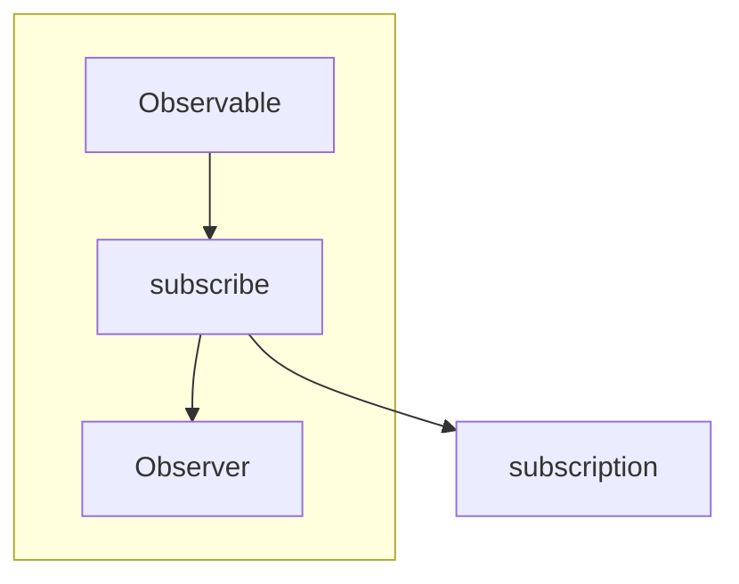

# why rxjs

rxjs 왜 쓰나요?

> RxJS 는
> 일관된 방식으로
> 안전하게
> 데이터 흐름을
> 처리하는
> 라이브러리 이다.

모든 어플리케이션은 궁극적으로 상태머신의 집합이다.

## 비동기 처리?

rxjs 는 비동기처리를 원할하게 할 수 있는 데이터스트림이다.

근데 Rxjs 말고 다른거 많자너? Promise/async & await ... 심지어 표준인데

시간축의 관점에서 결국 동기 === 비동기

Rxjs 는 다양한 방식(동기, 비동기)들을 하나의 방식으로 처리한다.

### Observable

옵저버블은 시간을 인덱스로 둔 컬렉션이다.

## 데이터 전파?

## 데이터 처리?

데이터를 받은 후에 데이터를 가공한다.

절차지향으로 작성하면 비즈니스 로직이 if 문 for 문에 파묻힘..

## Reactive Programming

데이터 흐름과 상태 변화 전파에 중점을 둔 프로그래밍 패러다임이다.
사용되는 프로그래밍 언어에서 데이터 흐름을 쉽게 표현할 수 있어야하며 기본 실행 모델이 변경사항을 **데이터 흐름** 
을 통해 **자동으로 전파한다** 는 것을 의미한다.

## Rxjs 의 주요개념

* **Observable**
* **Operator**
* **Observer**
* **Subscription**
* Subject
* Scheduler

## Rxjs 의 사용 패턴

1. 모든 데이터를 Observable 로 만든다.
2. Observable 데이터에 Operator(map, filter) 를 적용하여 데이터를 변형한다.
3. 원하는 데이터를 받아 처리하는 Observer 를 만든다.

